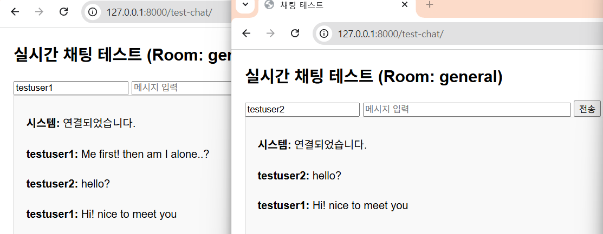
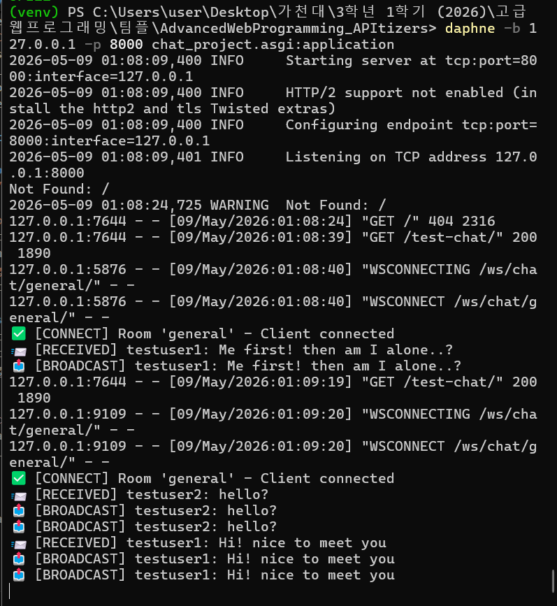

# Project Progress Log (Server Part - Cho HyunJun)
---

### May 07 - May 09, 2026 ------------------------------------------------------

**Work Completed**
- Initialized Django project and created apps (`accounts`, `chat`, `emotion_analyzer`)
- Configured basic settings (`settings.py`, CORS, Channels, Redis as Channel Layer)
- Set up SQLite database and created superuser
- Implemented real-time chat using **Django Channels + WebSocket**
- Created `ChatConsumer`, `routing.py`, and `asgi.py`
- Successfully switched from `runserver` to **Daphne** ASGI server
- Tested real-time messaging:
  - Multiple browser tabs can send and receive messages instantly
  - Messages are broadcasted correctly to the same room ("general")

**Issues Encountered & Solutions**

**Issue 1: WebSocket connection failed (404 Not Found)**
- Problem: `/ws/chat/general/` returned 404 error even though `/test-chat/` page loaded normally
- Reason: `python manage.py runserver` only supports WSGI and does not properly handle WebSocket (ASGI) connections
- Solution: Changed to **Daphne** ASGI server (`daphne -b 127.0.0.1 -p 8000 chat_project.asgi:application`)
- Result: Real-time chat now works perfectly

**Current Status**
- Real-time chat foundation is complete and stable
- Backend real-time communication is ready for frontend integration

**Next Steps**
- User authentication (register / login using accounts app)
- Chat room creation, list, and participation system
- Integration with emotion analysis module (Deepseek V4 pro + Markov Chain)

**Daily Note:** From now on, always use `daphne` command for development and testing of real-time features.

---